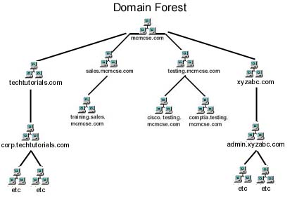

# 🧠 Unidad 4 — Instalación de Servicios de Directorios

---

## 🔹 Sistema Operativo de Red (SOR)

Un **Sistema Operativo de Red (SOR)** es un software que gestiona la infraestructura de una red informática, garantizando que los equipos puedan **compartir recursos de manera segura y eficiente**.  
Sin un SOR, las redes grandes serían un caos: no habría control centralizado sobre archivos, accesos ni seguridad.

*Figura 1. Ejemplo de red informática general.*

---

### 💻 Los ordenadores necesitan un sistema operativo

Así como un ordenador individual necesita un sistema operativo (Windows, Linux o macOS) para funcionar, una red con varios equipos **requiere un SOR** para gestionar usuarios, permisos y comunicaciones.

---

## ⚙️ Diferencias entre sistemas operativos estándar y de red

Los **sistemas operativos tradicionales** (Windows, macOS, Linux de escritorio) gestionan un único equipo.  
Los **SOR**, en cambio, gestionan toda la red, controlando dispositivos, usuarios y recursos compartidos.

*Figura 2. Esquema básico de un sistema operativo de red.*

---

## 🤝 Administración de redes entre iguales (P2P)

Las **redes entre iguales** (*peer-to-peer / P2P*) permiten compartir archivos sin un servidor central:  
cada equipo actúa como **cliente y servidor** al mismo tiempo.

*Figura 3. Ejemplo de red entre iguales (P2P).*

### 🔐 Problemas de administración y seguridad

- Cada usuario decide qué compartir → riesgo de exposición de información.  
- Sin organización, los archivos son difíciles de localizar.  
- Microsoft introdujo los **grupos de trabajo** para mejorar la organización, pero **sin resolver la seguridad**.

---

## 🧩 Estructura cliente-servidor

El **modelo cliente-servidor** divide las tareas entre:
- **Servidor →** proporciona servicios o recursos (correo, archivos, bases de datos...).  
- **Cliente →** solicita y utiliza esos servicios.

*Figura 4. Comunicación cliente-servidor.*

### 🔑 Ventajas principales

- Centraliza datos y seguridad.  
- Mejora la organización y escalabilidad.  
- Permite añadir nuevos clientes sin afectar al sistema.

---

## ⚠️ Problemas con múltiples servidores

Ejemplo con tres servidores:

| Servidor | Función principal |
|-----------|------------------|
| A | Aplicaciones empresariales |
| B | Correo electrónico |
| C | Bases de datos y documentos |

**Dificultades comunes:**
- Credenciales duplicadas por cada servidor.  
- Contraseñas no sincronizadas.  
- Baja y alta de usuarios manual.  
- Riesgo de errores y descoordinación.

---

## 🗂️ Servicios de Directorio

Un **servicio de directorio** es un sistema que **almacena, organiza y gestiona información** sobre usuarios, dispositivos y recursos de red.

*Figura 5. Ejemplo de directorio centralizado.*

### 🎓 Ejemplo

> En una universidad, los profesores acceden a calificaciones y documentos;  
> los alumnos, solo a materiales de clase.  
> Todo se gestiona automáticamente desde el servicio de directorio.

---

### 📁 Estructura de un servicio de directorio

Cada recurso se considera un **objeto** con **atributos** asociados:

| Atributo | Valor |
|-----------|-------|
| Nombre | Carlos Pérez |
| Cargo | Administrador de TI |
| Correo | carlos@empresa.com |
| Acceso a | Servidor de archivos, correo, VPN |

*Figura 6. Jerarquía de dominios, unidades organizativas y grupos.*

**Componentes principales:**

| Elemento | Descripción |
|-----------|-------------|
| **Directorio** | Base de datos con la información de la red. |
| **Dominio** | Conjunto de objetos dentro del directorio. |
| **Objeto** | Recurso (usuario, equipo, impresora...). |
| **Unidad organizativa (OU)** | Agrupa objetos por área o departamento. |
| **Grupo** | Conjunto de usuarios con permisos similares. |
| **Controlador de dominio** | Servidor que gestiona la base de datos. |
| **Catálogo global** | Contiene información resumida de todos los objetos. |
| **Maestro de operaciones** | Gestiona funciones críticas. |
| **Árbol / Bosque** | Estructuras jerárquicas de dominios. |
| **Esquema** | Define la estructura de los objetos. |

---

## 🧾 Identificación y acceso

Cada objeto tiene un **DN (Distinguished Name)** único.  
El sistema **DNS** se utiliza para gestionar estos nombres, igual que en Internet.

---

## 🧱 Ejemplos de servicios de directorio

| Servicio | Descripción |
|-----------|-------------|
| **Active Directory (AD)** | Solución de Microsoft. Amplio uso en empresas. |
| **OpenLDAP** | Implementación libre para Linux. |
| **SambaLDAP** | Integra OpenLDAP, Kerberos y Samba para compatibilidad Windows/Linux. |
| **Otros** | Novell Directory Services, Red Hat Directory Server, Apache Directory, etc. |

---

## 🌐 Protocolo LDAP

**LDAP (Lightweight Directory Access Protocol)** permite acceder y consultar servicios de directorio.  
Es esencial en redes corporativas y educativas.

*Figura 7. Esquema del funcionamiento del protocolo LDAP.*

---

📘 *Fin de la unidad – Instalación de servicios de directorios.*